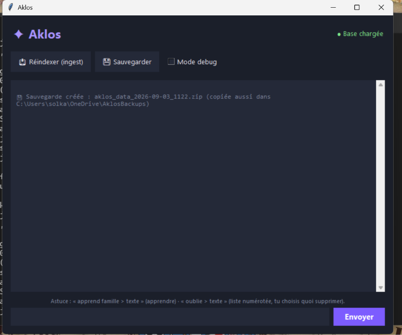

# Aklos — assistant IA personnel, 100% local

Assistant conversationnel RAG (Retrieval-Augmented Generation) qui tourne
entièrement sur ta machine, sans cloud, sans abonnement, sans connexion
internet une fois les modèles téléchargés. Pensé pour fonctionner sur du
matériel modeste (CPU seul, pas de GPU dédié) : ce n'est pas un compromis
temporaire, c'est le principe de conception.

h

## Pourquoi

Un assistant qui garde une vraie mémoire de travail — mes notes techniques
(Python, Rust, sécurité...), la continuité d'un projet d'écriture — sans
envoyer ces données à un service tiers. Le modèle ne "sait" que ce qu'on
lui donne à lire ; rien ne sort de la machine.

## Comment ça marche

1. Des fichiers texte (`.md`/`.txt`) sont déposés dans `data/`.
2. `ingest.py` les découpe en morceaux, calcule leurs embeddings avec
   Ollama, et les stocke dans une base vectorielle locale (ChromaDB).
3. `chat.py` retrouve les passages pertinents pour une question donnée et
   les fournit comme contexte au modèle de chat (`llama3.2:3b`) avant
   qu'il ne réponde.

Deux interfaces au choix : ligne de commande (`chat.py`) ou application
graphique Tkinter (`Aklos_app.py`, avec une variante de thème visuel dans
`Aklos_app_theme_rose.py`). Une interface web légère (`aklos_web.py`,
Flask) permet aussi d'y accéder depuis un autre appareil du même réseau
(tablette, téléphone) sans rien installer dessus.

## Stack technique

- **Modèles** : [Ollama](https://ollama.com) — `llama3.2:3b` pour la
  conversation, `nomic-embed-text` pour les embeddings. 100% CPU.
- **Base vectorielle** : [ChromaDB](https://www.trychroma.com), locale.
- **Code** : Python — Tkinter pour le bureau, Flask pour le web.

## Installation

Prérequis communs : Python 3.9+, et [Ollama](https://ollama.com/download)
installé.

```
ollama pull llama3.2:3b
ollama pull nomic-embed-text
```

### Windows

```
cd Aklos
pip install -r requirements.txt
```

Si `pip` n'est pas reconnu : `py -m pip install -r requirements.txt`.

### macOS

Ollama et Python doivent venir de Homebrew (le Python/Tcl-Tk fourni par
défaut avec macOS est trop ancien et cause des bugs d'affichage avec
Tkinter — texte ou fenêtre invisibles) :

```
brew install python git ollama
brew services start ollama
cd Aklos
python3 -m venv venv
source venv/bin/activate
pip install -r requirements.txt
```

## Utilisation

```
python ingest.py   # indexe (ou réindexe) le contenu de data/
python chat.py      # démarre le chat en ligne de commande
```

Ou `python Aklos_app.py` pour l'interface graphique. Chaque ajout ou
modification dans `data/` demande une réindexation pour être pris en
compte.

Commandes utiles dans le chat :
- `apprend famille > texte` — ajoute une info à `data/famille.md`
  (`apprend > texte` seul te demande où la ranger).
- `oublie > texte` — cherche les passages correspondants et demande
  confirmation avant toute suppression.

## Limites à avoir en tête

- Pas de GPU : plus lent qu'avec une carte graphique, mais un modèle 3B
  reste utilisable en usage interactif sur ce type de machine.
- C'est du RAG, pas du fine-tuning : la "personnalité" vient du contexte
  injecté (prompt système + documents récupérés), pas des poids du
  modèle — choix délibéré, plus réaliste sur ce matériel.
- `ingest.py` réindexe toute la base à chaque exécution (pas
  d'incrémental) — suffisant pour un usage personnel de quelques
  dizaines de fichiers.

## Licence

MIT — voir [LICENSE](LICENSE).
